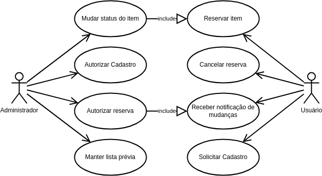
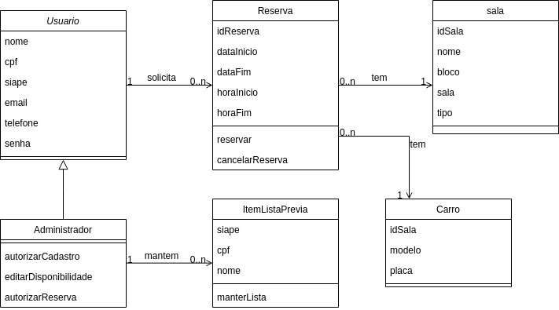

# RESERVY

RESERVY é um sistema de reservas de carros e veículos que permite a gestão de usuários e agendamentos de forma eficiente. O sistema possui dois tipos de usuários: Administrador e Usuário comum.

## Tecnologias Utilizadas

- **Frontend:** React.js
- **Backend:** Django
- **Banco de Dados:** SQLite
- **Comunicação entre Frontend e Backend:** Axios

## Diagramas UML

### Diagrama de Caso de Uso

### Diagrama de Classe

## Funcionalidades

### Usuário
- Cadastro de conta (Nome, CPF, SIAPE, E-mail e Senha)
- Confirmação do cadastro pelo Administrador (se estiver na lista prévia)
- Login no sistema
- Solicitação de reservas informando:
  - Motivo da reserva
  - Bloco
  - Sala
  - Data de início e horário inicial
  - Data final e horário final
- Edição de perfil (Nome, E-mail, Senha)
- Exclusão de perfil

### Administrador
- Aprova ou nega o cadastro de novos usuários
- Aprova ou nega solicitações de reserva
- Mantém a lista prévia de usuários (Nome, CPF e SIAPE)

#### [Backlog](https://github.com/users/thevictorgabriel/projects/2)

## Uso do Sistema
- O administrador deve cadastrar a lista prévia de usuários (Nome, CPF, SIAPE)
- Os usuários cadastrados só poderão acessar o sistema após aprovação do administrador
- As reservas também precisarão de aprovação antes de serem confirmadas

## Desing de Inteface
- FIGMA: [Protótipo](https://www.figma.com/design/Bt3hWvBnnAidKShryWMzrn/SUPER?node-id=713-2)

## Licença
Este projeto está sob a [licença MIT](LICENSE)
